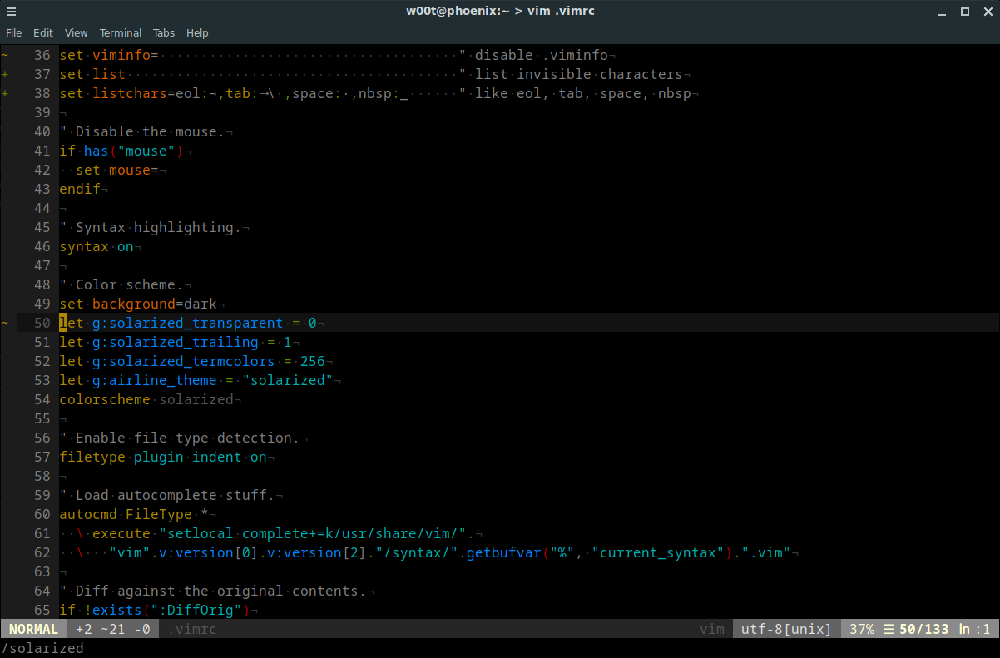

# Solarized

My mod of the popular Solarized theme.



## Installation

Simply put it in `~/.vim/bundle`.

## Configuration

``` vim
set background=dark
let g:solarized_transparent = 1         " Transparent background.
let g:solarized_trailing = 1            " Highlight trailing spaces.
let g:solarized_termcolors = 256        " This is only needed for Airline.
let g:airline_theme = "solarized"
colorscheme solarized
```

Based on https://github.com/altercation/vim-colors-solarized.
